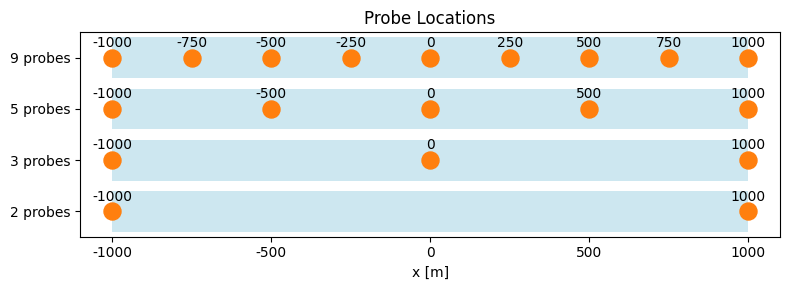
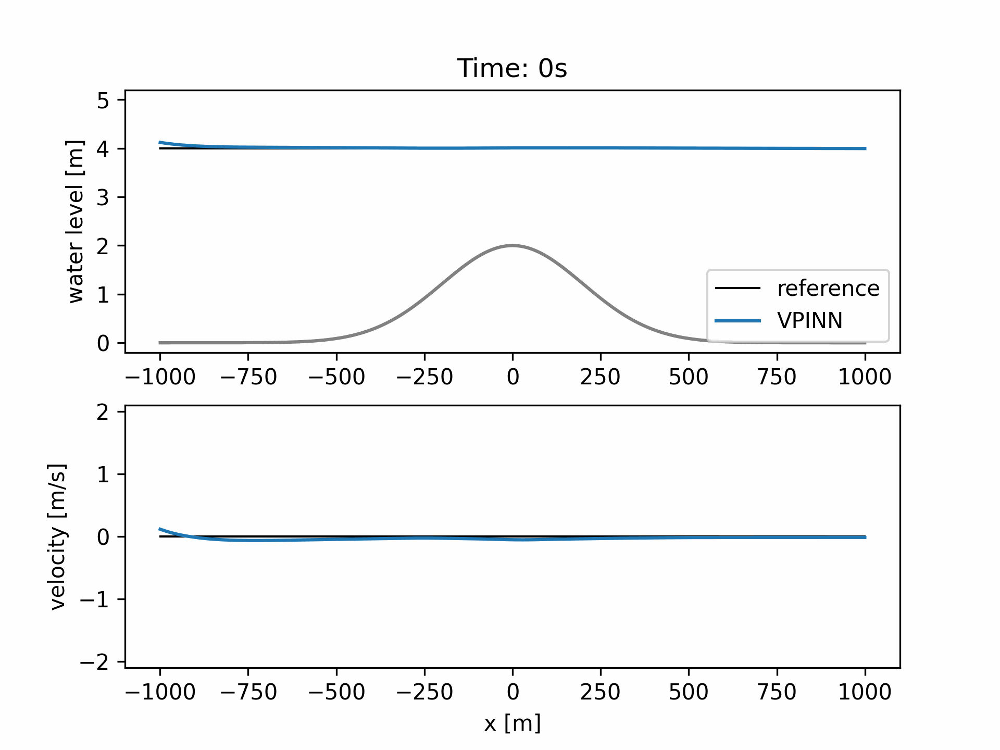

# VPINNs for 1D Flow-Field Reconstruction
This code implements a variational physics-informed neural network (VPINN) in order to reconstruct a flow-field governed by the 1D shallow water equation (SWE) based on sparse water depth observations.

## Investigated Case
### 1D-SWE:  
conservation of mass:  
$\frac{\partial}{\partial t} h + \frac{\partial}{\partial x} hu = 0$  

conservation of momentum:  
$\frac{\partial}{\partial t} hu + \frac{\partial}{\partial x} \left( hu^2 + \frac{1}{2}gh^2 \right) = -gh \frac{\partial b}{\partial x} -c_D u|u|$  
### Domain and Parameters:  
$x \in [-1000, 1000]$ &nbsp; ; &nbsp;  $t \in (0,600]$  
gravitational acceleration: $g = 9.81$  
bed: $b(x) = 2e^{-\frac{x^2}{2\*200^2}}$  

**I.C.:** $h(x,t=0)=4-b(x)$  
&nbsp; &nbsp; &nbsp;  &nbsp;  $hu(x,t=0)=0$  

**B.C.:** $h(x_L,t) = 4 + sin\left(0.005*2\pi t \right)$  
&nbsp; &nbsp; &nbsp;  &nbsp;  $\partial_x h(x_R,t) = \partial_x hu(x_L,t) = \partial_x hu(x_R,t) = 0$

## VPINNs
In contrast to traditional PINNs, VPINNs enforce the governing equations in their weak (variational) form over either the entire domain or (as we do here) a collection of subdomains rather than pointwise. In our implementation, we numerically approximate the weak-form integrals via Gauss–Legendre quadrature.

The PDE loss for the conservation of mass for the subdomain $k$ and test function $\phi^{(l)}$ with compact support has the form:  
$\mathcal{L}_{PDE\_{h}} = \left| \\sum_i \\sum_j w_i w_j \left( \partial_t \phi\_{i,j}^{(l)} \\; h\_{i,j} + \partial_x \phi\_{i,j}^{(l)} \\; hu\_{i,j} \right) \right|^2$  
Where $x_i$ and $t_j$ are quadrature nodes for the domain $k$ w.r.t. space and time and $w_i$ and $w_j$ are the corresponding quadrature weights.  

The complete loss regarding the conservation of mass computes to :  
$\mathcal{L}_{PDE\_{h}} = \frac{1}{n_{sub} \\; * \; n_{\phi}} \\sum_{k=1}^{n_{sub}} \sum_{l=1}^{n_{\phi}} \mathcal{L}_{PDE_h,k,l}$ &nbsp;  &nbsp; *($\mathcal{L}_{PDE_{hu}}$ is computed accordingly)*  

The final objective function is a weighted sum of all individual loss terms:  
$\mathcal{L}_{tot} = \lambda\_{data} \\; \mathcal{L}\_{data}$  

The final objective function is a weighted sum of all individual loss terms:  
$\mathcal{L}_{tot} = \lambda\_{PDE\_h} \\; \mathcal{L}\_{PDE\_h} + \lambda\_{PDE\_{hu}} \\; \mathcal{L}\_{PDE\_{hu}}+ \lambda\_{data} \\; \mathcal{L}\_{data}$  

### Subdomains
The code divides the computational domain into rectangular, non-overlapping, equal-sized subdomains. $n\\_sub$ defines the number of subdomains in each dimension, resulting in a total number of $n\\_sub^2$ subdomains with size $\frac{2000}{n\\_sub}m \times \frac{600}{n\\_sub}s$.  
$n\\_gauss$ defines the number of Gauss-Legendre quadrature nodes w.r.t. each dimension for each subdomain, resulting in a total of $n\\_gauss^2$ nodes per subdomain.  
The total number of nodes inside the domain is $n\\_sub^2*n\\_gauss^2$.  
### Test-Functions
For each subdomain spatio-temporal variabels are transformed into standard domain:  
$x \\; \longmapsto \\; \xi \in [-1,1] \quad ; \quad t \\; \longmapsto \\; \eta \in [-1,1]$  

In the standard domain the test function $\phi^{(l)}$ reads:  
$\phi^{(l)} \left( \xi , \eta \right) = B \left( \xi \right) \\; P^{(m)} \left( \xi \right) \\; B \left( \eta \right) \\; P^{(n)} \left( \eta \right)$  
Envelope functions ensuring compact support: $B \left( \xi \right) = 1-\xi^2 \quad ; \quad B \left( \eta \right) = 1-\eta^2$  
$m^{th}/n^{th}$ order Legendre polynomial of first kind: $P^{(m)} \left( \xi \right) \quad ; \quad P^{(n)} \left( \eta \right)$  

$n\\_test$ defines up to which order polynomials are considered for both dimensions. The variational loss is than evaluated for all $n\\_test^2$ possible combinations of $P^{(m)} \left( \xi \right)$ and $P^{(n)} \left( \eta \right)$ in each subdomain.

## Observations
Observations (as well as reference data for *nRMSE*) are taken from numerical simulation ([code](https://github.com/HSchmieder/1D-SWE_Godunov_Solver)). There are different number of probes [2,3,5,9] with fixed locations available (see figure). Furthermore it is possible to change the sampling frequency ( $1/f\geq 1s$ ) and corrupt the data by adding Gaussian noise. 

<figure>
  
</figure>

## Results (Example)
### Settings:
**Network:** hidden layer: 5 ; neurons per layer: 200  
**Training:** ADAM learning rate: 0.0005 ; Iterations: 5e4 ; weights = [1,1,1]  
**Observations:** number of probes: 5 ; sampling period ( $1/f$ ): 10s ; noise: 0  
**PDE-Loss:** n_sub = 10 ; n_gauss = 21 ; n_test = 5

### Performance:
***nRMSE(h)* = 0.0140**  
***nRMSE(u)* = 0.0253**

